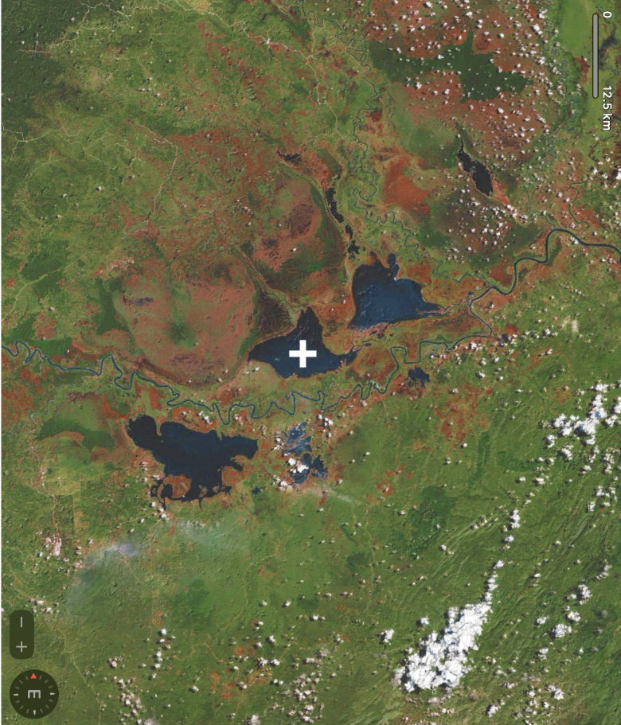

# Challenge 1: Target Reference Point

## Description
  
*Original image provided in the challenge.*
An image was provided for the first challenge, and we were tasked with identifying the lake marked by a cross. Using the compass in the bottom-left corner, I reoriented the image to its upright position and then ran it through Google Image Search.
Among the results, I found a visually similar image in an academic research paper titled “Waterbird Population Dynamics in the Middle Mahakam Wetlands of East Kalimantan over 23 years.” Although the colors differed slightly, the shapes of the lakes closely matched. The image in the paper identified the lake as Danau Melingtang, which allowed me to obtain the flag.

Flag:tisc{lake_melingtang}

## Sources
Yamashina Institute for Ornithology. Waterbird Population Dynamics. Kukila, 2014.

https://www.ykrasi.org/wp-content/uploads/2021/04/Waterbird-Population-Dynamics-Kukila-2014-2-min-2.pdf
