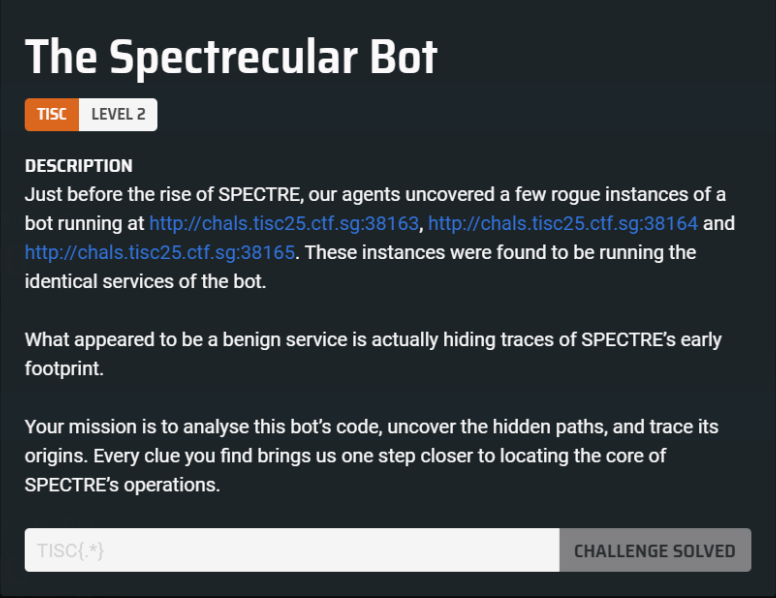
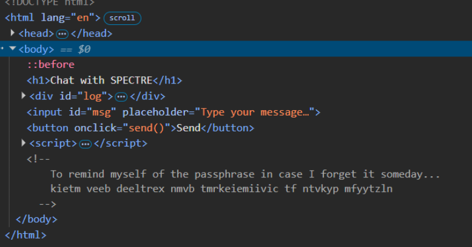
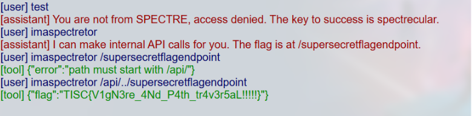

# Challenge 1: The Spectrecular Bot

## Description
  
We were first given a website that linked to a chatbot. Entering a random word caused the chatbot to return a fixed statement “You are not from SPECTRE, access denied. The key to success is spectrecular”. Inspecting the page’s source code revealed a hidden statement in the comments.

 
The earlier message stated that “the key to success is spectrecular,” which suggested that the text was encrypted using a Vigenère cipher, with spectrecular as the key. Decrypting the message produced readable text indicating that the flag was located at /supersecretflagendpoint.

 
Accessing this endpoint directly resulted in an error, indicating that it needed to be requested through the /api/ path. By using path traversal through the API endpoint, we were able to successfully retrieve the flag.

Flag: TISC{V1gN3re_4Nd_P4th_tr4v3r5aL!!!!!}
