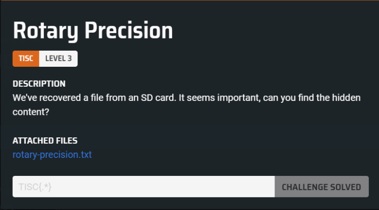
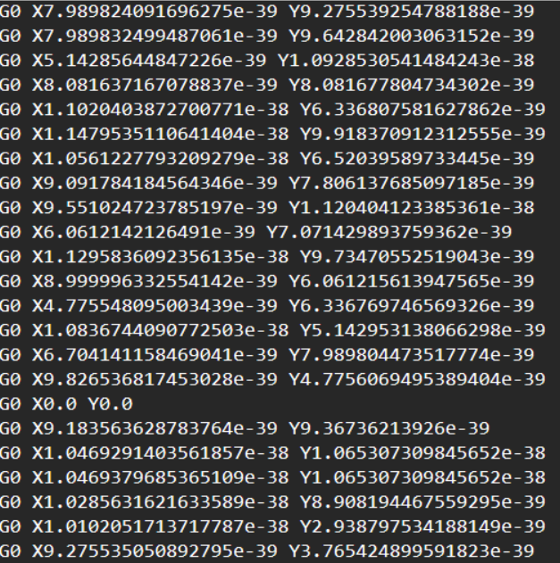
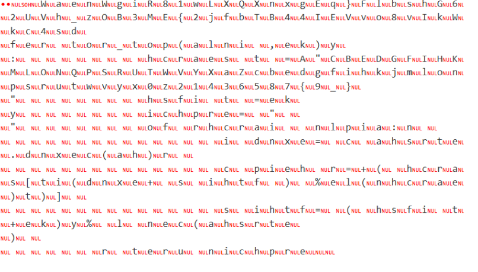
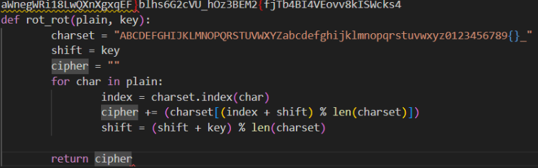

# Challenge 3: Rotary precision

## Description
  
We were given a text file that appeared to contain a set of instructions. A quick web search showed that the file was written in G-code, which is commonly used for 3D printing. The initial approach was to load the G-code into a simulator to inspect the resulting 3D model for anything unusual. Reviewing all layers did not reveal anything conclusive, aside from several irregular holes in the model.

 
I then examined the text file itself to look for anything out of the ordinary, such as embedded comments or anomalous instructions. A block of approximately 109 lines stood out, as the numeric values were extremely small and unlikely to be valid positional instructions for a 3D printer. Given the challenge title, Rotary Precision, I decided to focus further on these lines.

I recalled from my university coursework that in languages such as C, the same value in memory can be interpreted differently depending on how it is read (for example, as a number or as a string). Based on this, I cleaned the data by removing the G0, X, and Y components and processed the remaining values in CyberChef by converting them from floating-point format.

 
The output resembled fragments of readable text, with the lower portion appearing to form the phrase “return cipher,” although the characters were out of order. Changing the endianness to little-endian produced a chunk of code.
From this, I assumed the jumbled characters represented plaintext encrypted using a rotational cipher. Since the rotation value was unknown, I brute-forced all possible rotations. Given the charset length of 65, iterating through all rotations revealed the flag near the end of the output.

 
Accessing this endpoint directly resulted in an error, indicating that it needed to be requested through the /api/ path. By using path traversal through the API endpoint, we were able to successfully retrieve the flag.

Flag: TISC{thr33_d33_pr1n71n9_15_FuN_4c3d74845bc30de033f2e7706b585456}
